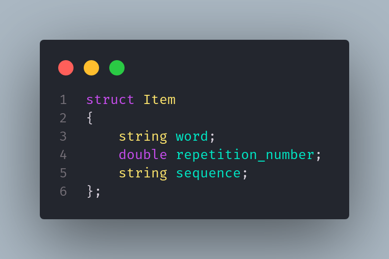
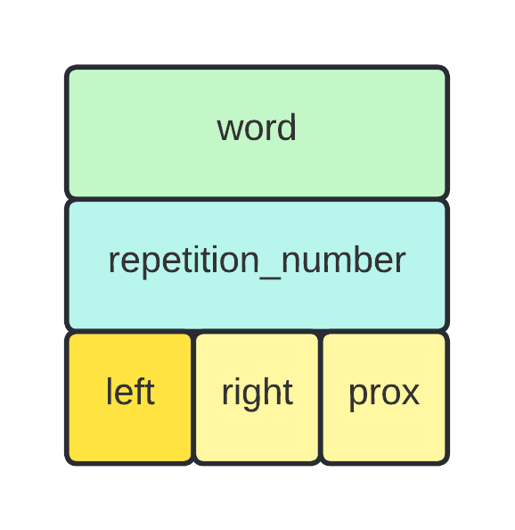
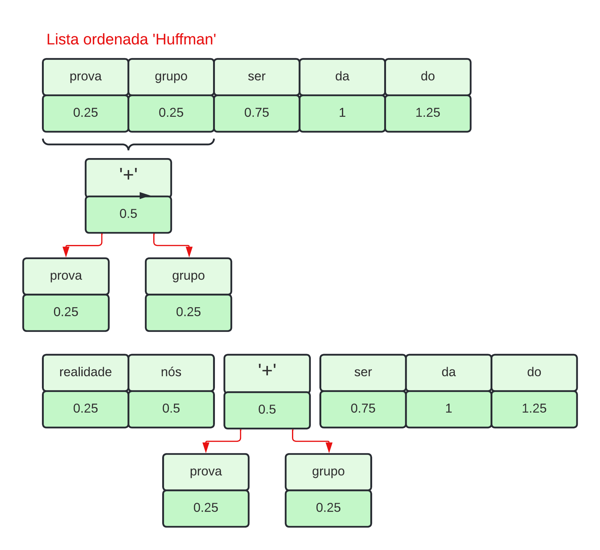
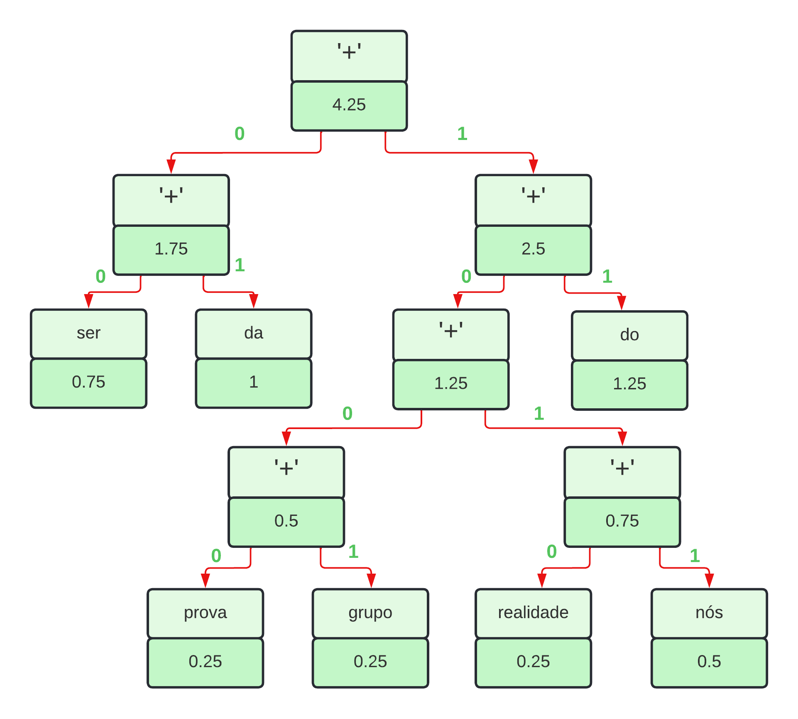
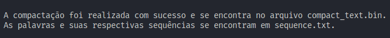

# Trabalho sobre o Código de Huffman
[](https://github.com/TFIDF-Project)
[](https://code.visualstudio.com/docs/?dv=linux64_deb)

<h1> Codificação e compactação de textos utilizando código de Huffman

## Conteúdos

<p align="center">
    <a href="#apresentação">Apresentação</a> •
    <a href="#lógica">Lógica</a> • 
    <a href="#resultados">Resultados</a> • 
    <a href="#bibliotecas">Bibliotecas</a> •
    <a href="#compilação-e-execução">Compilação e Execução</a> •
    <a href="#autor">Autor</a>
</p>

---

## Apresentação

Foi proposto pelo professor [Michel Pires da Silva](http://lattes.cnpq.br/1449902596670082) da matéria de `Arquitetura e Estruturas de Dados 2 do 4º Período do curso de Engenharia de Computação` um trabalho relacionado ao conteudo passado em suas aulas teoricas que são `Estrutura de Dados Árvore`, onde foi introduzido a `codificação de Huffman` e a sua implementação. Portanto foi desenvolvido o seguinte desafio:

_Elabore uma árvore binária que utilize o código de Huffman para comprimir arquivos. Para tanto, (1) contabilizar a recorrência de cada palavra (RP) no arquivo; (2) normalizar a contabilização entre 0 e 1 utilizando a formula -> RP / (max(RP) - min(RP)); (3) Montar a árvore com as regras apresentadas por Huffman; (4) Troque as palavras pela codificação binária (utilizar booleano para representar 0 e 1); (5) Salve o arquivo em formato binário e observe qual foi o ganho de espaço obtido._

Com isso, foi trabalhada a lógica abaixo, que obteve êxito apresentando uma solução para este trabalho!

---

## Lógica

Para a solução do problema proposto, foi utilizado a `Estrutura de Dados Lista Dinâmica` onde a mesma foi utilizada através de um repositorio feito pelo professor [Michel Pires da Silva](http://lattes.cnpq.br/1449902596670082) sendo ele [Lista Dinâmica](https://github.com/mpiress/dynamic_list), onde foram feitas apenas algumas alterações como conversão da linguagem *__C__* para *__C++__* e mudanças nas váriaveis presente em seu Item onde agora possui duas __strings__ sendo elas *word* e *sequence* onde vão armazenar respectivamente uma palavra presente no arquivo e mais a frente do código a sua sequencia 'booleana' e uma variavel do tipo __double__ onde vai armazenar a quantidade de vezes em que a palavra foi repetida ou sua normalização após o cálculo informado no enunciado.

<p align="center">

</p>

### • Contabilização da recorrência de cada palavra presente no arquivo

Primeiramente foi necessário ser feita a leitura de um arquivo do tipo _.txt_ contendo um texto sendo esse o alvo da compactação, onde no programa a função __ReadDocument()__ realiza esse trabalho recebendo como parâmetro uma `Lista Dinâmica` e uma estrutura de `Huffman` fazendo a leitura do arquivo _document.txt_ linha por linha, onde a cada linha lida é feita a tokenização de cada palavra e é feito o armazenamento dessas palavras em _vector tokens_ e com isso foi feita a remoção das vogais solitárias para que não houvesse interferência na normalização e codificação das palavras.
A recorrência foi feita checando as palavras de uma a uma, utilizando três estruturas de repetição do tipo `FOR` onde a primeira vai segurar uma palavra presente no _vector tokens_ , a segunda vai sempre começar a percorrer uma a frente para que não seja feita a verificação de duas mesmas palavras e a ultima estrutura vai percorrer o *vector verified_words*, um vector de strings onde a cada verificação das palavras é incremetada a palavra nesse vector,sendo feita a verificação de cada palavra do _vector tokens_ para que seja verificado se não vai haver uma segunda contabilização de determinada palavra, caso seja verificado que não foi realizado a verificação de cada palavra e que foi encontrado uma igual, será incremetado mais um na váriavel *repetition_count* para que no fim do segundo `FOR` seja feita a inserção da palavra e a sua quantidade de repetições na lista passada como parametro, fazendo no final a limpeza da váriavel *repetition_count* para que haja uma nova contabilização de uma outra palavra.

### • Normalização da contabilização

Para ser feita a normalização da contabilização primeiramente foi necessário encontrar o número máximo e o número minimo de repetições para que fosse possível normalizar a contabilização entre 0 e 1 utilizando a formula $\frac{RP}{maxRP - minRP}$ , portanto foi encontrado o maior e o menor número de repetição percorrendo a lista e então armazenando-os nas váriaveis *max_repetition* e *min_repetition* respectivamentes aplicando então a fórmula da normalização colocando o resultado na variavel *normalization* como abaixo:

```c++
	normalization = (aux2->data.repetition_number / (max_repetition - min_repetition));
```
Feito isso, vai ser armazenado o valor encontrado adicionando-o no Item da lista *repetition_number* de cada palavra em que foi feita a normalização

### • Montagem da árvore de Huffman

Já possuindo um lista de palavras com suas determinadas repetições normalizadas de maneira ordenada, foi possibilitada a criação da `Árvore de Huffman` que inicialmente é composta em seu nó por uma variável do tipo _Item_ que vai ser as váriaveis presentes no _Item_ da Lista Dinâmica e _ponteiros_ que apontam para os seguintes posições  _left_(esquerda), _right_(direita), _prox_(proximo) como possível a ver na representação abaixo:

<p align="center">

</p>

Ou seja, a `Árvore de Huffman` se tratará de uma lista encadeada ordenada e será preenchida através da função __FillHuffman()__ que vai receber como parametro a lista de palavras com suas repetições e a estrutura de _Huffman_, onde vai preencher a estrutura de _Huffman_ com elementos presentes na lista de maneira ordenada definindo seus nós como **NULL**, a partir disso vai ser criada a `Árvore de Huffman` sendo feita pela função __HuffmanTree()__ que constitue de um nó e recebe como parâmetro a estrutura _Huffman_ preenchida, fazendo então de dois novos nó, sendo eles _**first**_ e _**second**_ que através de uma estrutura de repetição `WHILE`, que repete enquanto o tamanho da estrutura é maior que 1, vai retirando os dois primeiros elementos da estrutura (os dois menores elementos) colocando-os respectivamente nos nós criados e assim então criando um terceiro novo nó chamado **new_no** que vai receber como parte do seu _Item word_ um caracter qualquer e do seu *Item repetition_number* a soma da normalização dos dois nós removidos, inserindo os dois nós removidos como filho direito e esquerdo deste novo nó e após isso insere novamente na lista, como possível visualizar na representação abaixo:

<p align="center">

</p>

(_OBS: A representação acima é referente a algumas palavras presentes no texto que está no arquivo *'documents.txt'* e também de possível visualização em <a href="#resultados">resultados</a>._)

Ao final desta função vai ser retornada o inicio da estrutura de _Huffman_ ou apenas um nó caso a estrutura possua um número impar de elementos.<br>

### • Codificação binária das palavras

Até o momento irá existir um nó chamado *tree* presente no algoritmo em que vai possuir toda a `Árvore de Huffman` e relacionada ao exemplo anterior vai estar como na representação a seguir:

<p align="center">

</p>

(_OBS: A representação acima é referente a algumas palavras presentes no texto que está no arquivo *'documents.txt'* e também de possível visualização em <a href="#resultados">resultados</a>._)


A resolução para a codificação binária das palavras é encontrada na função __GenerateSequence()__ onde recebe como parâmetro toda a `Árvore de Huffman` construida na função anterior como parâmetro, uma nova `Lista Dinâmica` criada para armazenar as sequências booleanas com suas respectivas palavras e uma _string_ chamada *way*, se tratando de uma função recursiva, já vai ser introduzida com uma estrutura de decisão `IF` onde verifica se chegou em uma folha, ou seja, os filhos esquerdos e direitos daquele nó são **NULL** e caso se tratar de uma folha vai ser passada a palavra e a sequência booleana em forma de _string_ que foi obtida durante toda a recursão da função para a `Lista Dinâmica`, caso contrario, significa ainda que possui filhos então é feita duas cópias do caminho gerado até ali, uma cópia continuará para a esquerda e a outra para a direita. Na cópia da esquerda vai ser concatenado um 0 na váriavel *left_way* e na cópia da direita vai ser concatenada um 1 na váriavel *right_way* e por fim vai ser feita duas chamadas recursivas da função __GenerateSequence()__, uma para a esquerda com a *left_way* e outra para a direita com o *right_way* passados como parâmetros

### • Escrita da codificação binária em um arquivo binário

A ultima etapa do código consiste em pegar toda a codificação feita na etapa anterior e escrever essa codificação em formato _booleano_ correspondentes as palavras que são encontradas no arquivo de texto inicial, para a solução desse proposito foi criado a fução __WriteBinaryFile()__ que recebe como parâmetro uma lista que contém as palavras com suas respectivas sequências booleanas e o _vector tokens_ criado no inicio do programa eu contém a tokenização do arquivo de texto a ser codificado. Diante disso, a função inicia com duas estruturas de repetição, sendo um `FOR` e um `WHILE` onde primeiramente o `FOR` irá percorrer o _vector tokens_ e o `WHILE` vai ser necessário para percorrer a lista que a cada posição percorrida vai ser feita a veriricação utilizando a estrutura de decisão `IF` , verificando se cada posição do _vecotr tokens_ corresponde a posição da lista e caso seja correspondente vai ser introduzido um novo `FOR` para converter a sequência que está na lista em tipo _string_ para tipo _bool_ através de um _vector bool_ que vai armazenando a sequência em formato booleano para no fim escrever posição por posição do _vector bool_ no novo arquivo do tipo _.bin_, que ao fim vai ser feita a limpeza desse vector para que possa ser utilizado novamente em uma nova palavra encontrada na verificação de igualdade do texto.

---

## Resultados

• Após toda a lógica acima ter sido implementada no algoritmo foi possível a obtenção da compactação do arquivo *'document.txt'* como forma de teste onde o mesmo continha o seguinte texto: 

_Caros amigos, a infinita diversidade da realidade única nos obriga à análise do demônio de Laplace. Por outro lado, a complexidade dos estudos efetuados cumpre um papel essencial na formulação da fundamentação metafísica das representações. Assim mesmo, a forma geral da proposição significativa deverá confirmar as consequências decorrentes do sistema de conhecimento geral._

_Neste sentido, o novo modelo estruturalista aqui preconizado auxilia a preparação e a composição das posturas dos filósofos divergentes com relação às atribuições conceituais. Baseando-se nos ensinamentos de Dewey, a canalizaçao do Ser do Ente garante a contribuição de um grupo importante na determinação das novas teorias propostas. A prática cotidiana prova que a consolidação das estruturas psico-lógicas não sistematiza essa relação, de tal modo que a pulsão funciona funciona como significado da determinação do Ser enquanto Ser._

Onde a partir desse texto foi visualizado que o arquivo _'.txt'_ do mesmo continha um total de **_953 bytes_** e após a compactção realizada pelo algoritmo foi criado um novo arquivo _'.bin'_ chamado *'compact_text.bin'* encontrando um tamanho de **_761 bytes_** do mesmo, concluindo que a compactação foi feita com sucesso, tendo um total de **_191 bytes_** compactados.

• Ao ser compilado e executado o programa irá gerar a seguinte mensagem:

<p align="center">

</p>

Diante disso um arquivo de texto chamado _'sequence.txt'_ irá ser criado no qual vai informar ao usuário todas as palavras presentes no texto com suas respectivas codificações booleanas, esse arquivo abre a possibilidade do usuário de consultar as codificações encontradas no arquivo binário.

---

## Bibliotecas

<p>Para o funcionamento do programa, é necessário incluir as seguintes bibliotecas: 
<ul>
    <li><code>#include 'stdbool.h'</code></li>
    <li><code>#include 'stdio.h'</code></li>
    <li><code>#include 'fstream'</code></li>
    <li><code>#include 'iostream'</code></li>
    <li><code>#include 'stdlib.h'</code></li>
    <li><code>#include 'vector'</code></li>
    <li><code>#include 'string'</code></li>
    <li><code>#include 'sstream'</code></li>
    <li><code>#include 'assert.h'</code></li>
</ul>

---

## Compilação e Execução

O programa feito de acordo com a proposta possui um arquivo Makefile que realiza todo o procedimento de compilação e execução. Para tanto, temos as seguintes diretrizes de execução:


| Comando                |  Função                                                                                           |                     
| -----------------------| ------------------------------------------------------------------------------------------------- |
|  `make clean`          | Apaga a última compilação realizada contida na pasta build                                        |
|  `make`                | Executa a compilação do programa utilizando o gcc, e o resultado vai para a pasta build           |
|  `make run`            | Executa o programa da pasta build após a realização da compilação             


---

## Autor

Desenvolvido por [Pedro Henrique Louback Campos](https://github.com/PedroLouback)

Aluno do 4° periodo do curso de `Engenharia de Computação` no [CEFET-MG](https://www.cefetmg.br)
